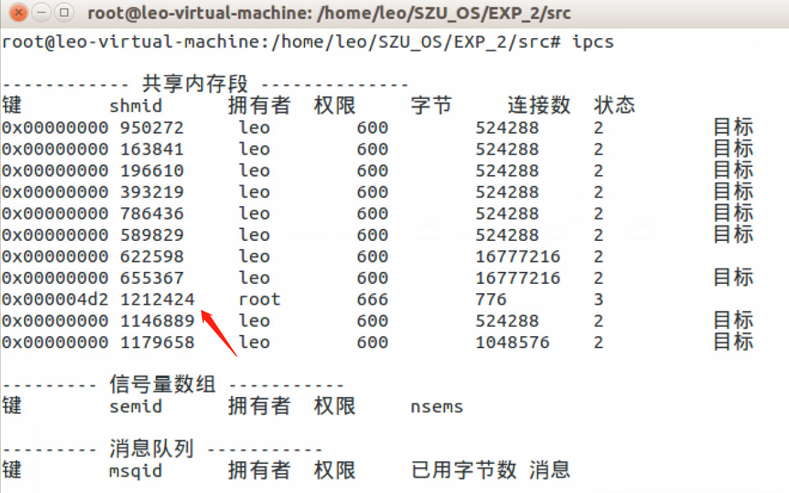

### 目录

* [实验目的与要求](#实验目的与要求)
  * [实验目的](#实验目的)
  * [实验要求](#实验要求)
* [实验过程及实验结果](#实验过程及实验结果)
    * [Linux进程间通信：管道、消息队列、共享内存](#Linux进程间通信：管道、消息队列、共享内存)
      * [管道](#管道)
      * [消息队列](#消息队列)
      * [共享内存](#共享内存)
    * [Linux进程间通信：程序设计](#Linux进程间通信：程序设计)
* [实验结论](#实验结论)
* [实验体会](#实验体会)
* [实验源码](#源码)

### 实验目的与要求

#### 实验目的

- 掌握进程同步与通信实验
- 加深对进程同步于通信操作的直观认识；
- 掌握Linux操作系统的进程、线程机制和编程接口；
- 掌握Linux操作系统的进程和线程间的同步和通信机制；
- 掌握经典同步问题的编程方法；


#### 实验要求

- 借助google工具查找资料，学习使用Linux进程间通信：管道、消息队列、共享内存；
- 设计编写以下程序，着重考虑其同步问题：
    - 一个程序（进程）从客户端读入按键信息，一次将“一整行”按键信息保存到一个共享存储的缓冲区内并等待读取进程将数据读走，不断重复上面的操作；
    - 另一个程序（进程）生成两个进程，用于显示缓冲区内的信息，这两个进程并发读取缓冲区信息后将缓冲区清空（一个进程的两次显示操作之间可以加入适当的时延以便于观察）。
    - 在两个独立的终端窗口上分别运行上述两个程序，展示其同步与通信功能，要求一次只有一个任务在操作缓冲区。
    - 运行程序，记录操作过程的截屏并给出文字说名。

要求使用posix信号量来完成这里的生产者和消费者的同步关系。


###  实验过程及实验结果

#### Linux进程间通信：管道、消息队列、共享内存
进程间通信（Inter-Process Communication，IPC）是指在两个或者多个不同的进程间传递或者交换信息，通过信息的传递建立几个进程间的联系，协调一个系统的多个进程之间的行为

##### 管道
管道主要用于父子或者兄弟进程间的数据读写，还有一种命名管道则可以在无关联的进程间进行沟通传递数据。管道的工作模式是半双工模式，即某一时刻只能单一方向传递数据，不能双向传递数据，换句话说，只能从一端写数据，从另一端读数据。管道由pipe()函数创建，即：
```C
#include <unistd.h>
int pipe(int fd[2]);
```
pipe()函数用于在内核中创建一个管道，该管道一端用于读取管道中的数据，另一端用于将数据写入管道。在创建一个管道后，会获得一对文件描述符，用于读取和写入，然后将参数数组fd中的两个值传递给获取到的两个文件描述符，fd [0]指向管道的读端，fd [1]指向写端。

pipe()函数调用成功，返回值为0；否则返回-1，并且设置了适当的错误返回信息。此函数只是创建了管道，要想从管道中读取数据或者向管道中写入数据，需要使用read()和write()函数来完成。当管道通信结束后，需要使用close()函数关闭管道的读写端。
 
<div align = center>

</div>

##### 消息队列
消息队列提供了一个从一个进程向另一个进程发送数据块的方法，每个数据块都可以被认为是有一个类型，接受者接受的数据块可以有不同的类型。

消息队列有以下特点：
- 生命周期随内核，消息队列会一直存在，需要我们显示的调用接口删除或使用命令删除
- 消息队列可以双向通信
- 克服了管道只能承载无格式字节流的缺点


##### 共享内存

两个不同进程A、B共享内存的意思是，同一块物理内存被映射到进程A、B各自的进程地址空间。进程A可以即时看到进程B对共享内存中数据的更新，反之亦然。由于多个进程共享同一块内存区域，必然需要某种同步机制，互斥锁和信号量都可以。

共享内存就是映射一段能被其他进程所访问的内存，这段共享内存由一个进程创建，但多个进程都可以访问，共享内存是最快的IPC方式，它是针对其他IPC方式运行效率低而专门设计的，它往往与其他机制，如信号量，配合使用，来实现进程间的同步。

#### Linux进程间通信：程序设计

程序过程：
1.	初始化信号量：互斥信号量(queue_mutex，初始化为1)、空缓冲区信号量(queue_empty，初始化为NUM_LINE)以及满缓冲区信号量(queue_full，初始化为0)。
2.	生产者(producer)生产产品：当queue_empty 在[0 , NUM_LINE)区间 且queue_mutex = 1时，生产者可以生产产品(客户端一次将“一整行”按键信息保存到一个共享存储的缓冲区)。
3.	消费者(customer)消费产品：当queue_empty 在(0 , NUM_LINE)区间 且queue_mutex = 1时，消费者可以消费产品(此时存在两个消费者在排队队伍中，在队头的消费者读取缓冲区信息后将缓冲区清空)。

原语：

<div align = center>

</div>

需求实现：

1. 一个程序（进程）从客户端读入按键信息，一次将“一整行”按键信息保存到一个共享存储的缓冲区内并等待读取进程将数据读走，不断重复上面的操作；

<div align = center>

</div>

2. 另一个程序（进程）生成两个进程，用于显示缓冲区内的信息，这两个进程并发读取缓冲区信息后将缓冲区清空（一个进程的两次显示操作之间可以加入适当的时延以便于观察）。

<div align = center>


</div>

3. 要求使用posix信号量来完成这里的生产者和消费者的同步关系。

<div align = center>

</div>

### 实验结论

1.	运行程序，使用ipcs命令查看共享内存区情况：

<div align = center>



</div>

2.	缓冲区设置最多输入存储3行(即NUM_LINE=3)，一次输入了五个产品，消费者轮流（顺序不定）消费产品；如果键盘输入过多行数据，由于使用gets()，数据存在缓冲中，当共享内存满了，即empty信号量值为0时，生产者不会读数据，只有等到empty信号量大于0的时候才会继续从键盘的缓冲区读取数据，所以看控制台的输出会有点乱；

<div align = center>

</div>

3.	为了让生产者等待，在消费者进程中加入sleep(3)，所以消费者输出产品较慢；可以看到，消费进程的产品输出是有顺序的，而且消费者交替出现。

<div align = center>


</div>

4.	当生产者输入“quit”，生产者释放信号量和共享内存后进程结束，消费者接受到“quit”后，相继结束进程

<div align = center>


</div>

5.	再次用ipcs查看共享内存情况，发现进程开始时创建的共享内存已经不存在

<div align = center>

</div>

### 实验体会

1. 掌握了Linux进程间通信的三种方式：管道、消息队列、共享内存
2. 通过实践实现了经典进程同步通信模型生产者-消费者问题，对共享内存以及信号量操作更加深入；

### 源码

- [shm_com_sem.h](src/shm_com_sem.h)
- [producer.c](src/producer.c)
- [customer.c](src/customer.c)
