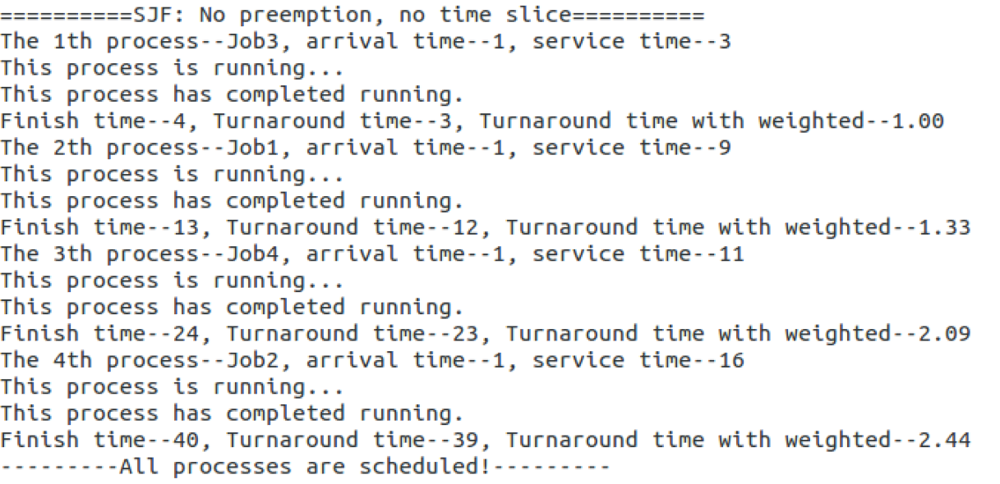
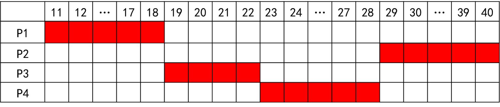
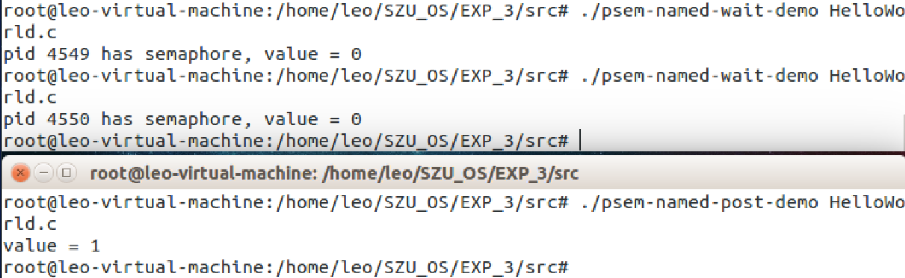

### 目录

* [实验目的与要求](#实验目的与要求)
  * [操作部分](#操作部分)
  * [编程部分](#编程部分)
* [实验过程及实验结果](#实验过程及实验结果)
    * [编程部分](#编程部分)
    * [操作部分](#操作部分)
* [实验体会](#实验体会)
* [实验源码](#源码)

### 实验目的与要求

#### 操作部分

- 学习 BlackBoard中的“综合1预备1-进程控制”，完成材料中的全部操作，并截屏记录（实验中2.2.2. 孤儿进程和僵尸进程, 2.2.3. exec 函数族,2.3. 创建pthread 线程2.4. 进程/线程资源开销 需要截屏记录，并配有必要的文字说明或结果的解读）。
- 学习 BlackBoard中的“综合1预备2-进程间通信与同步”，完成材料中的全部操作，并截屏记录（实验中的4.2. 进程间同步 需要截屏记录，并配有必要的文字说明或结果的解读）。

#### 编程部分

模拟在单处理器多进程操作系统的CPU调度。本实验为模拟实验，不要求实现真正的进程创建与进程调度。主要实现各种调度算法。

进程PCB结构：标识符、进程名称、到达时间、服务时间、剩余运行时间、已使用时间、进程状态。其中进程状态有三种：就绪R，运行E，结束F。

剩余运行时间和已使用时间两个属性用于时间片轮转算法和多级反馈队列算法。进程每使用完一个时间片，已使用时间就会增加一个时间片的长度，剩余运行时间=服务时间 – 已使用时间。

例程提供了两种测试数据：一种是程序内置数据，通过语句已经预先设置好，存放在数组pcbdata中，数据来源于课本P76第二个表格的数据，共5个进程。另一种方法是手工输入，使用函数input()，输入数据同样存放在数组pcbdata中。如果使用input函数，内置数据将不会使用。

- 阅读理解例程，掌握例程的运作流程。运行例程，理解先来先服务算法的调度原理和运行结果。
- 参考先来先服务算法，尝试实现其他四种调度算法：短作业优先、高响应比、时间片轮转、多级反馈队列。要求至少实现二种算法。（40分）
  - 除了多级反馈队列，其他算法采用非抢占调度
  - 短作业优先算法使用例题一数据或程序内置数据，要求运行结果给出调度顺序、完成时间、周转时间、带权周转时间
  - 高响应比算法使用例题二的数据，要求运行结果给出调度顺序、完成时间、周转时间、带权周转时间
  - 时间片轮转算法可以使用程序内置数据，要求运行结果给出每个时间片是被哪个进程使用，每个进程完成时，要修改状态并输出提示。
  - 多级反馈队列算法使用例题三的数据，要求运行结果给出正确的进程调度顺序和过程描述。

**例题一**：在单处理机环境下，对4个作业Job1、Job2、Job3、Job4进行非抢占式调度，它们的到达时间均为1，所需运行时间分别为9、16、3、11。
**例题二**：在单处理机环境下，对4个进程P1、P2、P3、P 4进行非抢占式调度，它们的到达时间分别为10、12、14、16，运行时间分别为8、12、4、6。
**例题三**：在某一操作系统中对进程调度采用多级反馈队列调度算法。现设定采用三级反馈队列调度算法，三个队列分别为I、II、III，对应时间片为2、4、8。现有四个进程A、B、C、D，到达时刻分别为0、5、7、12，执行时间分别为7、4、13、9。请写出整个进程调度过程。

###  实验过程及实验结果

#### 编程部分

##### 先来先服务调度算法(First Come First Service, FCFS)

###### 代码实现

###### 运行结果

###### 算法原理

当作业调度中采用该算法时，系统将按照作业到达的先后次序来进行调度，优先从后备队列中，选择一个或多个位于队列头部的作业，把他们调入内存，分配所需资源、创建进程，然后放入“就绪队列”,直到该进程运行到完成或发生某事件堵塞后，进程调度程序才将处理机分配给其他进程。

**从时间轴上看**

**从表格上看**

###### 算法优缺点

算法容易实现。但效率不高，只顾及作业等候时间，没考虑作业要求服务时间的长短。因此优待了长作业而不利于短作业；有利于CPU繁忙型作业，而不利于I/O繁忙型作业。

##### 短作业优先调度算法(shortest Job First, SJF)

###### 代码实现

###### 运行结果

###### 算法原理

短作业优先算法是以作业的长短来计算优先级，作业越短，其优先级越高。作业的长短是以作业所要求的运行时间来衡量的。

**从时间轴上看**

**从表格上看**

###### 算法优缺点

- 对长作业不利。严重的是，若一长作业(进程)进入系统的后备队列(就绪队列)，由于调度程序总是优先调度那些(即使是后进来的)短作业(进程)，将导致长作业(进程)长期不被调度——饥饿
- 完全未考虑作业(进程)的紧迫程度，因而不能保证紧迫性作业(进程)会被及时处理
- 由于作业(进程)的长短只是根据用户所提供的估计执行时间而定的，而用户又可能会有意或无意地缩短其作业的估计运行时间，致使该算法不一定能真正做到短作业优先调度。

##### 高响应比优先调度算法(Highest Response Ratio Next, HRRN)

###### 代码实现

###### 运行结果

###### 算法原理

高响应比优先调度算法既考虑作业的执行时间也考虑作业的等待时间，综合了先来先服务和最短作业优先两种算法的特点

该算法中的响应比是指作业等待时间与运行比值，响应比公式定义如下：

响应比 =（等待时间+要求服务时间）/ 要求服务时间,即RR=（w+s）/s=1+w/s，因此响应比一定是大于等于1的。

**从时间轴上看**

**从表格上看**

###### 算法优缺点

- 短作业与先后次序的兼顾，且不会使长作业长期得不到服务
- 响应比计算系统开销，增加系统开销

#### 操作部分

##### 学习 BlackBoard中的“综合1预备1-进程控制”，完成材料中的全部操作，并截屏记录。

###### 孤儿进程

首先运行[fork-demo](src/fork-demo.c)，共有两个进程（2955和2956）呈现父子关系：

然后在右边的终端中敲击回车键一次，此时 父进程退出，子进程成为孤儿进程并被 init 进程收养（子进程 2956 的 PPID 修改为指向1234号(init)进程）

最后再在右边的终端中点击回车键一次，此时子进程 2956 正常结束，没有造成任何资源浪费.

###### 僵尸进程

编译运行 [zombie-demo](src/zombie-demo.c) 程序，同时在另一终端上执行 ps j 命令可以看到字进程处于“Z+” 状态（表明是僵尸状态，<defunct>）

在运行 10 秒之后，父进程将执行 wait()处理字进程的遗留数据对象，子进程将从僵尸状态转为完全消失状态

###### Exec函数族

execve()函数的第一个参数就是想要变成的“新”进程影像（可执行文件），第二个参数 是命令行参数，第三个变是环境变量。这里可以看到子进程通过 execve()将自己变身为 “/usr/bin/pstree”，因此不再执行与父进程里的代码——即后面的“printf("this printf()will not be exec,because …”是没有机会得到执行的。真实的运行结果([fork-exec-demo](src/fork-exec-demo))如所示，可以看到子进程变成了 pstree。

###### 创建pthread 线程
  
运行 [pthread-demo](src/pthread-demo.c) 将看到两个线程都在执行，各自输出一行信息，等待 10 秒后两个线程 都将自动结束，在 pthread-demo 为结束前，可在另一个终端窗口执行 ps -aLf 查看信息。

###### 进程/线程资源开销

在 [fork-100-demo](src/fork-100-demo.c) 运行前、运行中和结束后各执运行一次 cat /proc/slabinfo |grep task_struct，可以看出，在 fork-100-demo 运行时，比运行前后都大约多了 83 个 task_struct 的数据对象（由于有进程动态创建与撤销，因此数据有扰动）

下面也来看看 [pthread-100-demo](src/pthread-100-demo.c) 运行前、运行中和结束后的 task_struct 数变化。可以 看出，在 pthread-100-demo 运行时，比运行前后都大约多了 83 个 task_struct 的数据对象（资源）

用 cat /proc/slabinfo |grep vm_area_struct 观察 fork-100demo，可以发现新增大约 17xx 左右的使用

然后对 thread-100-demo 的运行前、运行时和结束后，用用 cat /proc/slabinfo |grep vm_area_struct 观察，可以发现之需要新增大约 3x 左右的使用

##### 学习 BlackBoard中的“综合1预备2-进程间通信与同步”，完成材料中的全部操作，并截屏记录。

###### 进程间通信—有名信号量

用 gcc [psem-named-open.c](src/psem-named-open.c) –o psem-named-open –lthread（参数-lpthread 用于指出链 接时所用的线程库）完成编译，然后运行 psem-named-open()。如果没有输入作为标识的文件 名字符串，则给出提示要求用户输入；如果输入一个文件名字符串，正常情况将完成创建过程

编译并执行 [psem-named-wait-demo](src/psem-named-wait-demo.c)，输入前面创建信号量时使用的文件名标识，此时打印出当前信号量值为 0（也就是说前面创建的时候初值是 1）。如果在运行一遍，此时信号量的值已经为0，在进行V操作（减1 操作）将阻塞该进程。psem-named-wait-demo 第二次运行后并没有返回到 shell 提示符，如果此时 用另一个中断执行 ps 命令可以看到该进程处于 S 状态。

编译并执行 [psem-named-post-demo](src/psem-named-post-demo.c) （与前面 psem-named-wait-demo 不在同一个终端 shell 上），可以看到此时信号量的值增加到 1，并使得原来阻塞的 psem-named-post-demo 被唤醒 并执行完毕.

###### 进程间通信—互斥量

编译后运行 no-mutex-demo（注意编译时要有-lpthread 参数指出所需的线程库），每次运行结果并不唯一（共享变量未能得到互斥访问）。

运行 mutex_demo，每次运行都获得相同的结果。由于实现了共享变 量的互斥访问，因此每次运行的结构都是确定的值。

### 实验体会

基本掌握了进程控制与进程间通信的内容，以及部分进程调度的内容，在BlackBoard提供的材料错别字多，内容顺序出错的情况下，艰难认真的把材料看完了，收获很大！做完实验后准备再重新复习一遍，看能不能再找出材料中的错误，巩固自己的所学知识！

### 源码

- [scheduling_algorithm_2.c](src/scheduling_algorithm_2.c)
