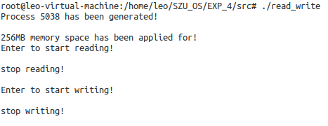
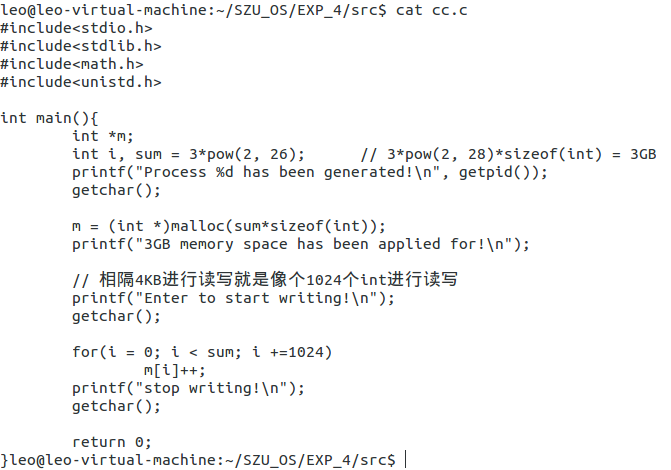

### 目录

* [实验目的与要求](#实验目的与要求)
  * [实验目的](#实验目的)
  * [实验要求](#实验要求)
* [实验过程及实验结果](#实验过程及实验结果)
* [实验体会](#实验体会)
* [实验源码](#源码)

### 实验目的与要求

#### 实验目的

- 加深对内存分配与使用操作的直观认识；
- 掌握Linux操作系统的内存分配与使用的编程接口；
- 了解Linux操作系统中进程的逻辑编程地址和物理地址间的映射；


#### 实验要求

- 借助google工具查找资料，学习使用Linux进程的内存分配、释放函数；(10分)

- 借助google工具查找资料，学习Linux proc文件系统中关于内存影射的部分内容（了解/proc/pid/目录下的maps、status、smap等几个文件内部信息的解读）；(10分)

- 编写程序，连续申请分配六个128MB空间（记为1~6号），然后释放第2、3、5号的128MB空间。然后再分配1024MB，记录该进程的虚存空间变化（/proc/pid/maps），每次操作前后检查/proc/pid/status文件中关于内存的情况，简要说明虚拟内存变化情况。推测此时再分配64M内存将出现在什么位置，实测后是否和你的预测一致？解释说明用户进程空间分配属于课本中的离散还是连续分配算法？首次适应还是最佳适应算法？用户空间存在碎片问题吗？(20分)

- 设计一个程序测试出你的系统单个进程所能分配到的最大虚拟内存空间为多大。(10分)

- 编写一个程序，分配256MB内存空间（或其他足够大的空间），检查分配前后/proc/pid/status文件中关于虚拟内存和物理内存的使用情况，然后每隔4KB间隔将相应地址进行读操作，再次检查/proc/pid/status文件中关于内存的情况，对比前后两次内存情况，说明所分配物理内存（物理内存块）的变化。然后重复上面操作，不过此时为写操作，再观察其变化。（10分）

- 选做：编写并运行（在第5步的程序未退出前）另一进程，分配等于或大于物理内存的空间，然后每隔4KB间隔将相应地址的字节数值增1，此时再查看前一个程序的物理内存变化，观察两个进程竞争物理内存的现象。（20分）

- 分配足够大的内存空间，其容量超过系统现有的空闲物理内存的大小，1）按4KB的间隔逐个单元进行写操作，重复访问数遍（使得程序运行时间可测量）；2）与前面访问总量和次数不便，但是将访问分成16个连续页为一组，逐组完成访问，记录运行时间。观察系统的状态，比较两者运行时间，给出判断和解释。（20分）

###  实验过程及实验结果

##### 学习使用Linux进程的内存分配、释放函数；

**malloc**

声明：void *malloc(size_t size);

作用：分配足够的内存给大小为size的对象，并返回指向所分配区域的第一个字节的指针，若内存不够,则返回NULL，并且 不对分配的空间进行初始化。（其中，指针的类型为void*，size_t代表的是unsigned int）

```C
int *number;
number = (int *)malloc(sizeof(int));//分配一个大小为sizeof(int)的存储空间,返回的指针需要强转成需要的类型
if (NULL == number) {
//判断调用是否成功，不成功就退出
    exit(0);
}
*number = 100;//内存里的内容没有被初始化，值不确定，此处需要初始化
free(number);//用完之后要free，释放内存
number = NULL;//防止出现野指针
```

**calloc**

声明：void *calloc(size_t num, size_t size);

作用：为一个大小为num的数组分配内存，每个元素的大小是size，并且将每个元素初始化为0，同时返回指向所分配区域的第一个字节的指针。若内存不够，则返回NULL。

```C
int *number;
int i = 0;
number = (int *)calloc(3, sizeof(int));//分配一个大小为3*sizeof(int)的存储空间,
if (NULL == number) { //判断调用是否成功，不成功就退出
    exit(0);
}
for (i; i<3; i++){
    printf(“address:%d number[%d] = %d\n”, &number[i], i, number[i]);//打印结果是0
}
free(number);//用完之后要free，释放内存
number = NULL;//防止出现野指针
```

**realloc**

声明：void* realloc (void* ptr, size_t size);

作用：将ptr所指向的内存空间的大小改为size个字节。如果新分配的内存比原内存大，那么原内存的内容保持不变，增加的空间不进行初始化。如果新分配的内存比原内存小，那么新内存保持原内存的内容，增加的空间不进行初始化。返回指向新分配空间的指针。若内存不够,则返回NULL，原ptr指向的内存区不变。

```c
int * number;
int * renumber;
number = (int *)calloc(5, sizeof(int))
if (NULL == number) {
//判断调用是否成功，不成功就退出
    exit(0);
}

renumber = (int *)realloc(number, 3 * sizeof(int));
if (NULL != renumber) {
//如果分配成功，就让number指向新分配的内存，这样不会造成内存泄漏,因为number原来指向的内存已经被自动回收。
    number = renumber;
}
renumber = NULL;
free(number);//这里只需要free number就可以了。
number = NULL;
```

**free**

声明：void free (void* ptr);

作用：回收由malloc/calloc/realloc分配的内存空间。

##### 学习Linux proc文件系统中关于内存影射的部分内容（了解/proc/pid/目录下的maps、status、smap等几个文件内部信息的解读）；

Linux proc文件系统，proc文件系统并不是真正意义上的文件系统，它存在于内存中，并不占用磁盘空间，包含一些结构化的目录和虚拟文件，向用户呈现内核中的一些信息，也可以用作一种从用户空间向内核发送信息的手段；

/proc 文件系统的根目录中，在左边是一系列数字编号的文件。每个实际上都是一个目录，表示系统中的一个进程。由于在 GNU/Linux 中创建的第一个进程是 init 进程，因此它的 process-id 为 1。然后对这个目录执行一个 ls 命令，这会显示很多文件。每个文件都提供了有关这个特殊进程的详细信息。

<div>

</div>

以其中一个进程为例，打开进程文件目录，可以看到其中包含许多文件和目录，比如exe文件（进程相关的可执行文件）、root（指向进程根目录）、maps（可执行文件和库文件图）、status（进程状态）、smaps（maps扩展，显示mapping的内存）等等：

<div>

</div>

**cat  /proc/[pid]/maps 显示进程映射了的内存区域和访问权限**

在maps文件中，一共有6列：

第一列代表进程中内存映射占据的地址空间，格式为十六进制的BeginAddress - EndAddress

第二列代表权限，共四个字符，依次为rwxs或rwxp，其中r为read，w为write，x为execute，s为shared，p为private，对应位置没有权限时用一个短横线代替

第三列代表内存映射地址在文件中的字节偏移量

第四列代表映射文件的主设备号和次设备号

第五列代表映像文件的节点号，即inode，0表示内存映射区域没有关联的inode，如未初始化的BSS数据段就是这种情况

第六列代表映像文件的路径

<div>

</div>

 **cat  /proc/[pid]/status 显示进程状态，占用虚拟内存情况，占用物理内存情况等可读性好的进程相关信息**

<div>

</div>

 **cat  /proc/[pid]/smaps 文件，内存映射信息**

第一行内容同maps文件，剩下的是各种类型的内存映射大小，其中Rss表示当前常驻在RAM中的内存，Pss表示进程按比例共享的内存。

<div>

</div>

##### 编写程序，连续申请分配六个128MB空间（记为1~6号），然后释放第2、3、5号的128MB空间。然后再分配1024MB，记录该进程的虚存空间变化（/proc/pid/maps），每次操作前后检查/proc/pid/status文件中关于内存的情况，简要说明虚拟内存变化情况。推测此时再分配64M内存将出现在什么位置，实测后是否和你的预测一致？解释说明用户进程空间分配属于课本中的离散还是连续分配算法？首次适应还是最佳适应算法？用户空间存在碎片问题吗？

连续申请分配六个128MB空间（记为1~6号）前后maps文件对比信息，对比maps可以看出申请内存后地址的变化，当调用malloc申请内存后，存在堆(heap)，地址为7fdba7f1f000-7fdbd80e3000，而当没有调用malloc函数申请内存前，堆(heap)则不存在；从status文件信息中，可以看到VmPeak进程地址空间增加了790668-4288=786380KB=786432KB-52KB=6*128MB-52KB，VmSize进程虚拟地址空间的大小增加了790668-4212=786456KB=786432KB+24KB=6*128MB+24KB，VmData程序数据段的大小增加了786520-64=786456KB=6*128MB+24KB，VmPTE该进程的页表的大小增加了24KB，voluntary_ctxt_swicthes进程制动切换的次数增加了一次。

<div>
	
    
</div>

<div>
    
    
</div>

下图是释放2号内存空间后maps文件信息的变化，可以看到堆内存地址段一分为二，其中一段7fdba7f1f000-7fdbc7f23000，另一段是7fdbcff24000-7fdbd7f25000，所以2号内存的地址段为7fdbc7f23000-7fdbcff24000，而1号内存地址段为7fdbcff24000-7fdbd7f25000，这两个的地址段大小都是128MB；

<div>
    
</div>

下图是释放3号内存空间后maps文件信息的变化，可以看到堆内存地址段变成了7fdba7f1f000-7fdbbff22000和7fdbcff24000-7fdbd7f25000，所以3号内存的地址段为7fdbbff22000-7fdbc7f23000，大小为128MB；

<div>
    
</div>

下图是释放5号内存空间后maps文件信息的变化，可以看到堆内存地址段由两段变成三段；

<div>
    
</div>

根据上面3次释放内存的maps文件信息变化可以得出：

6号128MB内存段（存在）：（7fdba7f1f000-7fdbaff20000）

5号128MB内存段（释放）：（7fdbaff20000-7fdbb7f21000）

4号128MB内存段（存在）：（7fdbb7f21000-7fdbbff22000）

3号128MB内存段（释放）：（7fdbbff22000-7fdbc7f23000）

2号128MB内存段（释放）：（7fdbc7f23000-7fdbcff24000）

1号128MB内存段（存在）：（7fdbcff24000-7fdbd7f25000）

释放三次内存的status文件信息变化：可以发现VmPeak大小不变，VmSize与VmData大小均减少一半。

<div>
    
    
</div>

再申请1024M内存空间，可以看到6号地址段变成了7fdb67f1e000-7fdbaff20000，大小为1152MB，即1024MB+128MB；同时，status文件信息中，VmSize和VmData以及VmPeak都增加了内存；

<div>
    
</div>

<div>
    
    
</div>

再申请64MB内存空间，maps文件信息中1号地址变成了7fdbcbf23000-7fdbd7f25000，大小为192MB，即64MB+128MB；同时，status文件信息中，VmSize和VmData以及VmPeak都增加了内存；

<div>
    
</div>

<div>
    
    
</div>

结论：虚拟内存变化情况如上面的分析；用户进程空间分配属于连续分配算法，可以从实验结果看出，程序中代码或数据的逻辑地址是相邻连续的，即为用户程序分配的是一个连续的内存空间。其次，1024MB大于前面的两个256MB（被释放的2号和3号内存区）和128MB（被释放的5号内存区），实验结果得到的是该内存段最后被分配在6号内存区之后；64MB小于前面的两段256MB和128MB，而且256MB在128MB前面，分配64MB内存时选择了在256MB内存碎片地址段而不是更小碎片的128MB，因此，选择的是首次适应算法。连续分配算法，在释放中间的内存段时会将一条连续内存段切割成两条独立的内存段，被释放的内存段形成碎片，因此存在碎片问题。

##### 设计一个程序测试出你的系统单个进程所能分配到的最大虚拟内存空间为多大

<div>
    
    
</div>

用status查看耗尽内存前后的详细内存使用情况，可以看出此时VmPeak进程地址空间大小增加了(3551352-4288)KB=3.38GB，并且从打印结果3465MB=3.38GB可以验证出，当前进程能分配的最大的虚拟空间是3.38GB，而该Linux虚拟机的设定内存大小是2 GB。

<div>
    
    
</div>

##### 编写一个程序，分配256MB内存空间（或其他足够大的空间），检查分配前后/proc/pid/status文件中关于虚拟内存和物理内存的使用情况，然后每隔4KB间隔将相应地址进行读操作，再次检查/proc/pid/status文件中关于内存的情况，对比前后两次内存情况，说明所分配物理内存（物理内存块）的变化。然后重复上面操作，不过此时为写操作，再观察其变化

<div>
    
    
</div>

分配256MB内存空间前后，调用status查看内存情况，具体情况如下图所示，可以看出VmSize（虚拟内存）增加了（266360-4212）KB=256MB，而VmRSS（程序正在使用的物理内存）则没有增加，voluntary_ctxt_switches（进程主动切换次数）增加了一次；

<div>
    
    
</div>

读操作结束前后，调用status查看两者的内存情况，具体情况如下图所示，可以看出VmSize（虚拟内存）不变，VmRSS（程序正在使用的物理内存）同样不变，voluntary_ctxt_switches（进程主动切换次数）增加了一次；

<div>
    
    
</div>

写操作结束前后，调用status查看两者的内存情况，具体情况如下图所示，可以看出VmSize（虚拟内存）不变，VmRSS（程序正在使用的物理内存）增加了(263364-628)KB，约等于256MB，voluntary_ctxt_switches（进程主动切换次数）增加了1次，nonvoluntary_ctxt_switches（进程被动切换次数）增加了1次；

<div>
    
</div>

可以看出，读操作不需要物理内存，写操作需要使用物理内存。

##### 选做：编写并运行（在第5步的程序未退出前）另一进程，分配等于或大于物理内存的空间，然后每隔4KB间隔将相应地址的字节数值增1，此时再查看前一个程序的物理内存变化，观察两个进程竞争物理内存的现象。（20分）

<div>
    
    
</div>

<div>
    
    
</div>

由上图可以发现，进程被动次数多了1052次，说明它们之间存在竞争关系，且竞争激烈，这跟它们占用的物理内存大小有关；

##### 分配足够大的内存空间，其容量超过系统现有的空闲物理内存的大小，1）按4KB的间隔逐个单元进行写操作，重复访问数遍（使得程序运行时间可测量）；2）与前面访问总量和次数不便，但是将访问分成16个连续页为一组，逐组完成访问，记录运行时间。观察系统的状态，比较两者运行时间，给出判断和解释。

代码time_1是顺序访问数组，代码time_2是将数组切割成十六份，每份由一个线程负责访问，总共十六个线程。

代码time_2比代码time_1慢。从status文件信息也可以看出，time_1 的voluntary_ctxt_switches（进程主动切换次数）比time_2少。

<div>
    
    
</div>

<div>
    
    
</div>

### 实验体会

- 读操作不需要物理内存，写操作需要物理内存

- 最大虚拟内存空间比物理内存大一些

- 加深了对内存分配与使用操作的直观认识；

- 掌握了Linux操作系统的内存分配与使用的编程接口；

- 了解了Linux操作系统中进程的逻辑编程地址和物理地址间的映射；

### 源码

- [cc.c](src/cc.c)
- [mm.c](src/mm.c)
- [read_write.c](src/read_write.c)
- [time_1.c](src/time_1.c)
- [time_2.c](src/time_2.c)
- [vmSize_test.c](src/vmSize_test.c)
