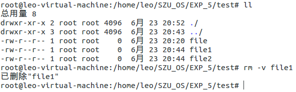

### 目录

* [实验目的](#实验目的)
* [实验要求](#实验要求)
* [实验环境](#实验环境)
* [实验步骤及说明](#实验步骤及说明)

### 实验目的

- 了解Linux 文件命令行操作命令；
- 了解Linux ext3文件系统上的软硬链接；

### 实验要求

- 可以使用Linux或其它Unix类操作系统；
- 学习该操作系统提供的文件系统的命令行接口；
- 学习文件的软硬链接的使用；

### 实验环境

- 硬件：桌面PC
- 软件：Linux 或其他操作系统

### 实验步骤及说明

##### 学习使用Linux文件系统提供的的ls 、touch、rm、cp、mv、mkdir等命令（希望尽量涵盖各种满足日常编程所需操作），记录相关命令执行结果

**ls常用命令**

- 显示当前目录下包括隐藏文件在内的所有文件列表

- 列出可读文件和文件夹详细信息

- 显示文件的inode信息，索引节点（index inode简称为“inode”）是Linux中一个特殊的概念，具有相同的索引节点号的两个文本本质上是同一个文件（除文件名不同外）

**Touch命令**

- 如果该文件不存在，则不创建该文件

- touch -r test1 test2 即：把test2的时间设置成和test1一样

- 设定文件的时间戳

**rm命令**

- -f选项表示：不管文件是否存在均不出现提示

- -r/-R表示：指示rm将参数中列出的全部目录和子目录均递归地删除。

- -i表示：在删除文件前，提示确认信息。一般情况下，Linux都对这个命令重定义为这个选项。即默认情况下删除文件都会存在提示

- -v表示：执行后显示正在进行的动作，同其他命令

 **cp命令**

- 复制一个源文件到目标文件（夹）。命令格式为：cp 源文件 目标文件（夹）

- 同时复制多个文件到目标文件（夹）下。命令格式为：cp 源文件1 源文件2 目标文件夹 或 cp 文件* 目标文件夹

- 复制源文件夹到目标文件夹下。命令格式为：cp -r 源文件夹 目标文件夹

**mv命令**

- -b：当目标文件存在时，先进行备份在覆盖

- -f：当目标文件存在时，强制覆盖

- -i：默认选项，当目标文件存在时，提示是否覆盖

	

**mkdir命令**

- 创建一个空目录

- 递归创建多个目录

- 创建权限为777的目录

- 创建新目录都显示信息

- 一个命令创建项目的目录结构

##### 学习Linux文件系统中关于文件硬链接和软链接的概念和相关操作命令，创建软硬链接各一个，给出实验证据表明它们分别是软硬连接；

为解决文件的共享使用，Linux 系统引入了两种链接：硬链接 (hard link) 与软链接（又称符号链接，即 soft link 或 symbolic link）。链接为 Linux 系统解决了文件的共享使用，还带来了隐藏文件路径、增加权限安全及节省存储等好处。若一个 inode 号对应多个文件名，则称这些文件为硬链接。换言之，硬链接就是同一个文件使用了多个别名。

- 硬链接可由命令 link 或 ln 创建。由于硬链接是有着相同 inode 号仅文件名不同的文件，因此硬链接存在以下几点特性：
  - 文件有相同的 inode 及 data block；
  - 只能对已存在的文件进行创建（超级用户才可以）；
  - 不能交叉文件系统进行硬链接的创建；
  - 不能对目录进行创建，只可对文件创建；
  - 删除一个硬链接文件并不影响其他有相同 inode 号的文件。

相关操作：

	
    
    

文件 old.file 与 hard.link 有着相同的 inode 号：660650 及文件权限，inode 是随着文件的存在而存在，因此只有当文件存在时才可创建硬链接，即当 inode 存在且链接计数器（link count）不为 0 时。inode 号仅在各文件系统下是唯一的，当 Linux 挂载多个文件系统后将出现 inode 号重复的现象，因此硬链接创建时不可跨文件系统。设备文件目录 /dev 使用的文件系统是 devtmpfs，而 /root（与根目录 / 一致）使用的是磁盘文件系统 ext4。

- 软链接与硬链接不同，若文件用户数据块中存放的内容是另一文件的路径名的指向，则该文件就是软连接。软链接就是一个普通文件，只是数据块内容有点特殊。软链接有着自己的 inode 号以及用户数据块。因此软链接的创建与使用没有类似硬链接的诸多限制：
  - 软链接有自己的文件属性及权限等；
  - 可对不存在的文件或目录创建软链接；
  - 软链接可交叉文件系统；
  - 软链接可对文件或目录创建；
  - 创建软链接时，链接计数 i_nlink 不会增加；
  - 删除软链接并不影响被指向的文件，但若被指向的原文件被删除，则相关软连接被称为死链接（即 dangling link，若被指向路径文件被重新创建，死链接可恢复为正常的软链接）。

相关操作：

	

- 创建软硬链接各一个，给出实验证据表明它们分别是软硬连接
  - 创建A.file、B.file；
  - 为A.file创建硬链接A.link；为B.file创建软链接B.link；
  - 用命令（ls -liF）查看可以发现软链接和硬链接详细信息不同，软链接会有指向一个文件；
  - 将文件A.file和B.file都删除掉，用cat命令分别查看A.link和B.link，发现A.link文件（硬链接）可以查看而B.link文件（软链接）会提示该文件不存在。
  - 因此，可以用命令（ls -liF）查看文件详细信息区别软硬链接；删除链接指向的文件，通过查看链接是否还存在且可读也可以区别它们。

	

##### 构建以下目录子树：

	

- 构建目录子树

	

- Tree命令查看构建的目录子树

	
	

